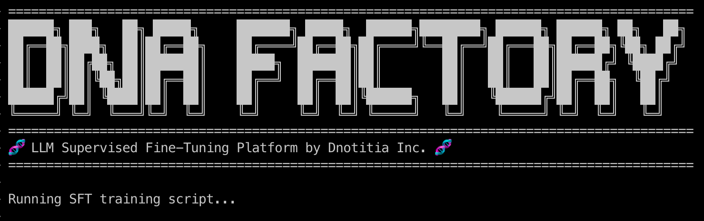

# DNA Factory



# Key Features

1. **Unified Color-Coded Logging**: Provides unified logging format with color-coded messages from various packages including 'huggingface_hub', 'datasets', 'tokenizers', 'transformers', 'torch', 'accelerate', and 'trl' for better readability.
1. **Auto-Generated Output Directory**: Automatically generates output directory names based on the model name and user-specified CLI arguments (e.g., `Qwen3-0.6B-SFT-num_train_epochs-2-learning_rate-1e-4`), making it easy to organize and track different training runs.
1. **Comprehensive Default Configuration**: Provides detailed default YAML configuration with extensive comments that users can easily override with their own config files or CLI arguments.
1. **Pre-configured Multi-GPU Training Options**: Includes ready-to-use configurations for DDP, DeepSpeed ZeRO Stage 1/3, and CPU offloading to support various training scenarios.


# Design Principles

- **One Way Approach**  
We choose one proven approach for each technology decision. For example, we use DeepSpeed instead of FSDP because we have more experience and better results with DeepSpeed.
- **Lightweight Design**  
No unnecessary bloat or additional packages that don't directly contribute to the core functionality.
- **Clean and Readable Code**  
Every line of code is written to be easily understood and maintained by any developer.

# News
- Sep/02/2026 - Added **On-Policy Distillation** support! 🚀
- Jun/05/2026 - Added **GRPO (Group Relative Policy Optimization)** support! 🚀
- Oct/29/2025 - Added **DPO (Direct Preference Optimization)** support! 🚀
- Sep/21/2025 - **DNA Factory** is born! 🎉

# How to Run

```bash
$ uv sync
$ CAUSAL_CONV1D_FORCE_BUILD=TRUE uv pip install causal-conv1d --no-build-isolation --no-cache-dir --verbose  # Optional
$ source .venv/bin/activate
```

You can run it in a simple way:
```bash
$ python sft.py
```

## Advanced Usage

You can use CLI options:

```bash
$ python sft.py \
  --model_name_or_path Qwen/Qwen3-0.6B \
  --dataset_name dnotitia/Reasoning_R1_Kor_completion_25k_sharegpt_v1 \
  --num_train_epochs 2
```

You can also use your custom YAML configuration:
```bash
$ python sft.py \
  --config configs/SFT/qwen3-0.6B-sft.yaml
```

You can even combine both CLI and YAML approaches:
```bash
$ python sft.py \
  --config configs/SFT/qwen3-0.6B-sft.yaml \
  --num_train_epochs 2
```

Choose whichever approach works best for you!

## Multi GPUs

If you want to train a small-sized model and just need faster training speed, use MULTI-GPU type. It's sufficient for training models effectively:

```bash
$ accelerate launch --config_file accelerate_configs/multi_gpu.yaml \
    --num_processes 2 \
    sft.py \
    --config configs/SFT/qwen3-0.6B-sft.yaml
```

If you want to offload `Parameters`, `Gradients`, and `Optimizer States` to reduce memory usage, you should use DeepSpeed ZeRO like this:

```bash
$ accelerate launch --config_file accelerate_configs/zero1.yaml \
    --num_processes 2 \
    sft.py \
    --config configs/SFT/qwen3-0.6B-sft.yaml
```

We support only ZeRO Stage 1 and ZeRO Stage 3 to keep DNA Factory simple and straightforward.

## Multi Nodes

```bash
# Master
$ accelerate launch --config_file accelerate_configs/zero1.yaml \
    --num_machines 2 \
    --num_processes 16 \
    --main_process_ip 10.233.71.18 \
    --main_process_port 6000 \
    --machine_rank 0 \
    sft.py \
    --config configs/SFT/smollm3-sft.yaml

# Worker
$ accelerate launch --config_file accelerate_configs/zero1.yaml \
    --num_machines 2 \
    --num_processes 16 \
    --main_process_ip 10.233.71.18 \
    --main_process_port 6000 \
    --machine_rank 1 \
    sft.py \
    --config configs/SFT/smollm3-sft.yaml
```

# GRPO

GRPO is an online RL method: completions are generated during training and scored by reward functions. Datasets are prompt-only (a `prompt` column; extra columns such as `solution` are forwarded to the reward functions). Rewards are configured in YAML via `reward_funcs` (built-in names from `trl.rewards`, dotted import paths — including this repo's own judge and string-match rewards in `dna_factory.rewards`) and/or `reward_model_name_or_path`:

```bash
# Single GPU (vLLM colocate mode is enabled by default; it shares the training GPU,
# so keep memory headroom via `vllm_gpu_memory_utilization: 0.3`)
$ python grpo.py \
  --config configs/GRPO/qwen3-0.6B-grpo.yaml

# Without vLLM (slower generation through transformers)
$ python grpo.py \
  --config configs/GRPO/qwen3-0.6B-grpo.yaml \
  --use_vllm false

# Multiple GPUs
$ accelerate launch --config_file accelerate_configs/zero3.yaml \
    --num_processes 4 \
    grpo.py \
    --config configs/GRPO/qwen3-0.6B-grpo.yaml
```

If you prefer dedicating separate GPUs to generation, use vLLM server mode instead of colocate:

```bash
# Terminal 1: vLLM server on a dedicated GPU
$ CUDA_VISIBLE_DEVICES=0 trl vllm-serve --model dnotitia/Qwen3-0.6B

# Terminal 2: training on the remaining GPUs
$ CUDA_VISIBLE_DEVICES=1 python grpo.py \
  --config configs/GRPO/qwen3-0.6B-grpo.yaml \
  --vllm_mode server
```

Note: the effective generation batch size (`per_device_train_batch_size` × number of processes × `steps_per_generation`) must be divisible by `num_generations`.

Reward functions (built-in `trl.rewards`, LLM-as-judge, and string-match) are documented in [docs/grpo-rewards.md](docs/grpo-rewards.md).

# On-Policy Distillation

On-policy distillation trains a **student** on completions it generates itself, scored token by token by a frozen **teacher**. The objective is the per-token reverse KL, `KL(student ‖ teacher)`. Compared to the other trainers it combines the on-policy trajectories of RL with the dense per-token supervision of SFT, which is where its order-of-magnitude compute advantage over RL comes from:

| | supervision | trajectories | signal density |
|---|---|---|---|
| SFT | fixed reference answers | off-policy (dataset) | per token |
| DPO | preference pairs | off-policy (dataset) | per sequence |
| GRPO | reward functions | on-policy (student) | per sequence (scalar reward) |
| **Distillation** | **a teacher model** | **on-policy (student)** | **per token** |

Datasets are prompt-only, just like GRPO. The teacher is set in YAML via `teacher_model_name_or_path` and **must share the student's vocabulary**:

```bash
# Single GPU (vLLM colocate is enabled by default; the teacher shares the same GPU,
# so keep memory headroom via `vllm_gpu_memory_utilization: 0.25`)
$ python distill.py \
  --config configs/Distill/qwen3-0.6B-distill.yaml

# Without vLLM (slower generation through transformers)
$ python distill.py \
  --config configs/Distill/qwen3-0.6B-distill.yaml \
  --use_vllm false

# Multiple GPUs
$ accelerate launch --config_file accelerate_configs/zero3.yaml \
    --num_processes 4 \
    distill.py \
    --config configs/Distill/qwen3-0.6B-distill.yaml
```

Note: `beta` here selects the divergence itself (`1.0` = reverse KL, `0.0` = forward KL, `0.5` = JSD) — unlike GRPO's `beta`, which is a KL-penalty coefficient against a reference model. There is no reference model in distillation.

Full guide: [docs/distillation.md](docs/distillation.md).

# References
- <https://github.com/huggingface/trl>
- <https://github.com/huggingface/open-r1>
- <https://github.com/huggingface/alignment-handbook>
